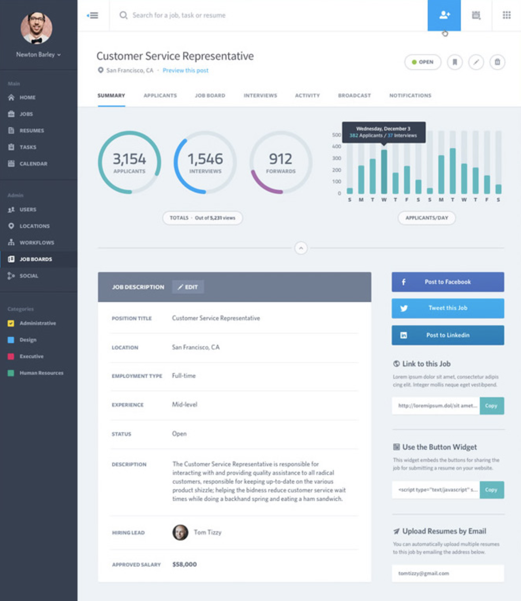
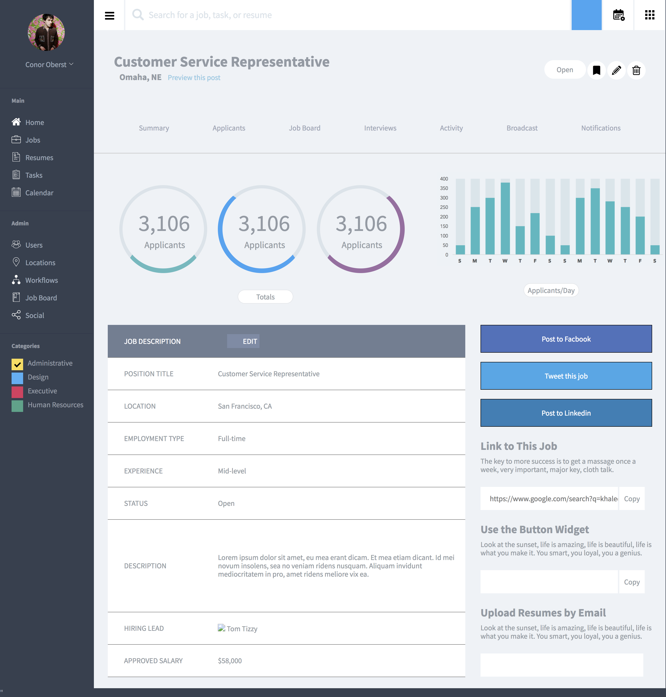

# 3-static-comp
# tm-comp-challenge-3

Static Comp Challenge #3

The static-comp-3 is the third and final static comp project fo rthe mod-1 front-end program at Turing. This comp static comp is the most complex and I decided to just stick with a very similar theme to the one that was given. The most difficut part for me was creating a mobile layout that was drastically different than the desktop version which involved adding additional HTML.

